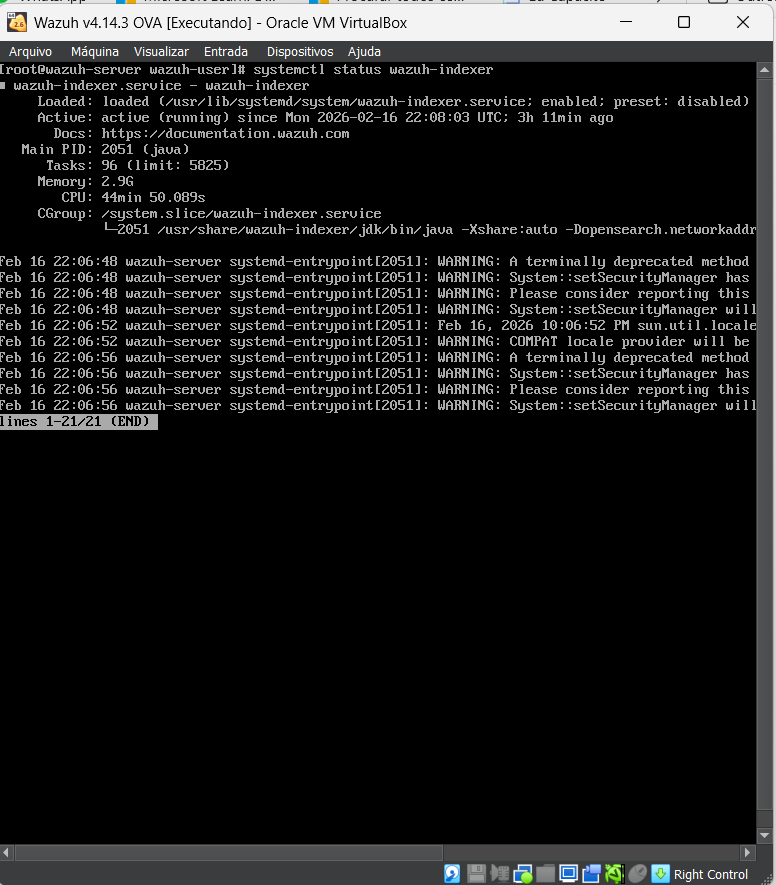
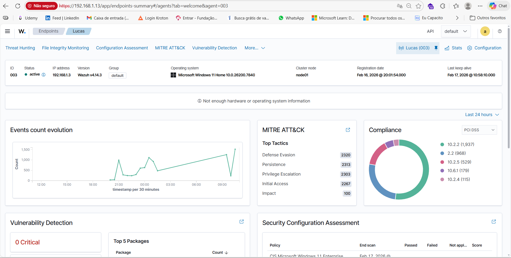
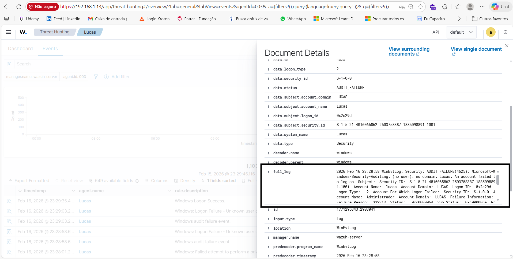
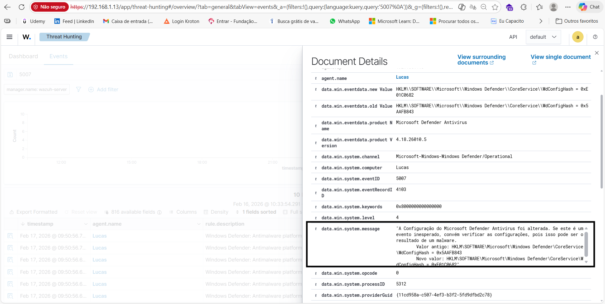
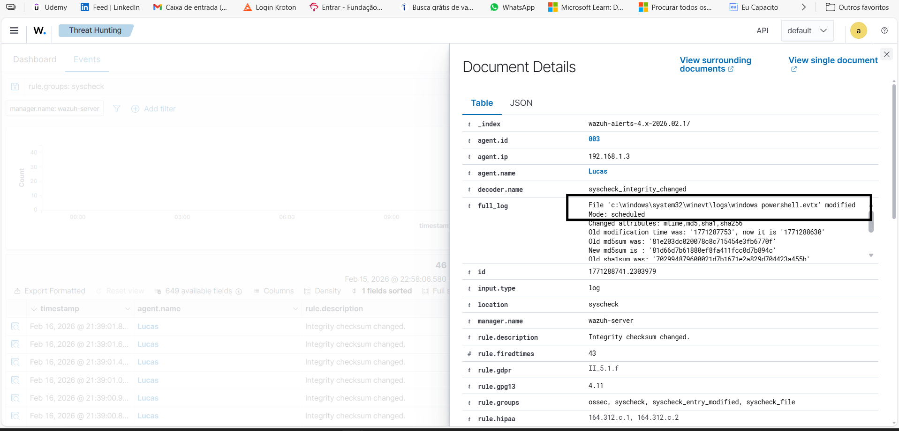
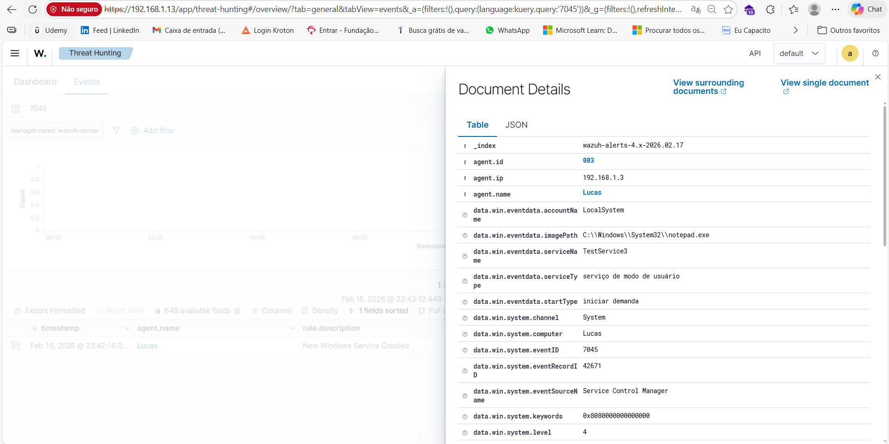
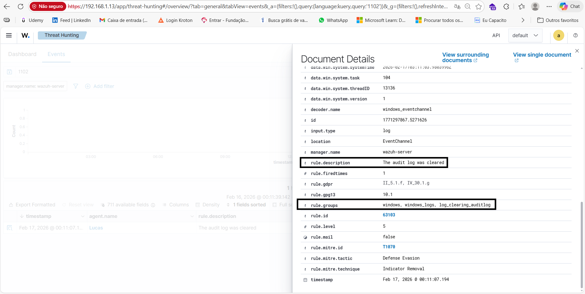

# 🛡️ Wazuh SOC Lab – Threat Detection & Incident Response

Projeto prático de laboratório SOC utilizando **Wazuh v4.14.3 OVA**, simulando ataques reais em ambiente controlado para detecção, análise e resposta a incidentes de segurança.

---

# 📌 Objetivo

Demonstrar habilidades práticas de:

- Monitoramento com SIEM
- Análise de logs Windows e Linux
- Investigação de incidentes
- Mapeamento MITRE ATT&CK
- Resposta a incidentes
- Documentação técnica de eventos de segurança

---

# 🏗️ Arquitetura do Laboratório

- **SIEM:** Wazuh 4.14.3 (Manager + Indexer + Dashboard)
- **Servidor:** Wazuh OVA
- **Endpoints monitorados:**
  - Windows (com Sysmon)
  - Linux (SSH)
- **Virtualização:** VirtualBox

---

# 📊 Validação do Ambiente

## 🔹 Serviços Wazuh em Execução

```bash
systemctl status wazuh-manager
systemctl status wazuh-indexer
systemctl status wazuh-dashboard
```

### Evidências






---

# 🔎 Incidentes Simulados e Detectados

---

## 1️⃣ Brute Force Attack – Windows Logon Failure

**Event ID:** 4625  

### Descrição
Múltiplas tentativas de autenticação falhas detectadas contra conta local.

### Evidência Visual


### Classificação MITRE ATT&CK

- **Tática:** Credential Access  
- **Técnica:** T1110 – Brute Force  
- **Subtécnica:** T1110.001 – Password Guessing  

---

## 2️⃣ SSH Brute Force – Linux

### Evidência Visual


### Classificação MITRE ATT&CK

- **Tática:** Credential Access  
- **Técnica:** T1110 – Brute Force  
- **Subtécnica:** T1110.001 – Password Guessing  

---

## 3️⃣ Criação de Conta Local

**Event ID:** 4720  


### Classificação MITRE ATT&CK

- **Tática:** Persistence  
- **Técnica:** T1136 – Create Account  
- **Subtécnica:** T1136.001 – Local Account  

---

## 4️⃣ Modificação de Conta

**Event ID:** 4738  


### Classificação MITRE ATT&CK

- **Tática:** Persistence  
- **Técnica:** T1098 – Account Manipulation  

---

## 5️⃣ Execução de Processo

**Event ID:** 4688  


### Classificação MITRE ATT&CK

- **Tática:** Execution  
- **Técnica:** T1059 – Command and Scripting Interpreter  

---

## 6️⃣ File Integrity Monitoring (FIM)



### Classificação MITRE ATT&CK

- **Tática:** Impact  
- **Técnica:** T1565 – Data Manipulation  

---

## 7️⃣ Criação de Serviço

**Event ID:** 7045  



### Classificação MITRE ATT&CK

- **Tática:** Persistence  
- **Técnica:** T1543 – Create or Modify System Process  
- **Subtécnica:** T1543.003 – Windows Service  

---

## 8️⃣ Limpeza de Logs

**Event ID:** 1102  



### Classificação MITRE ATT&CK

- **Tática:** Defense Evasion  
- **Técnica:** T1070 – Indicator Removal  
- **Subtécnica:** T1070.001 – Clear Windows Event Logs  

---

# 📘 Lições Aprendidas

- Importância do monitoramento de eventos críticos como 1102 (log clearing)
- Correlação entre eventos 4625 + 4688 aumenta precisão da detecção
- Hardening em SSH reduz superfície de ataque
- Monitoramento contínuo de criação e modificação de contas administrativas
- FIM é essencial para detectar manipulação de dados

---

# 🚀 Melhorias Futuras

- Integração com SOAR (Shuffle ou n8n)
- Alertas automatizados por e-mail
- Integração com VirusTotal API
- Criação de playbooks automatizados
- Implementação de Active Response no Wazuh

---

# 👨‍💻 Autor

**Lucas**  
Estudante de Segurança da Informação  
Foco em SOC Analyst / Blue Team