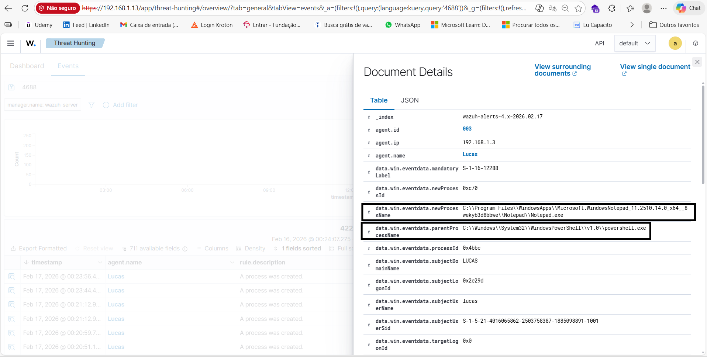

# Lab SOC Wazuh

Este repositório documenta a configuração e detecção de eventos de segurança em um laboratório SOC com Wazuh.  
Os tópicos estão organizados por etapas de detecção de ataques e monitoramento do ambiente Windows.

---

## 01 – Agente Ativo
  
Verificação do status do agente Wazuh conectado ao manager.

---

## 02 – Dashboard em execução
  
O painel do Wazuh está funcionando corretamente, mostrando alertas e eventos do agente.

---

## 03 – Indexer em execução
  
Confirmação de que o serviço de indexação do Wazuh está ativo, permitindo a ingestão dos logs.

---

## 04 – Integridade de arquivos (Checksum Alterado)
  
Detecção de alteração em arquivos monitorados pelo File Integrity Monitoring (FIM), indicando possível modificação não autorizada.

---

## 05 – Criação de Conta Local
  
O Wazuh detectou a criação de uma conta local no Windows. Monitoramento importante para identificar ações de invasores que criam contas com privilégios.

---

## 06 – Criação de Processo (Event ID 4688)
  
Registro da criação de novos processos no sistema. Permite rastrear programas suspeitos que podem executar malware ou dump de credenciais.

---

## 07 – Tentativa de Logon Falha (Event ID 4625)
  
Monitoramento de tentativas de login falhas, útil para identificar ataques de força bruta via SSH ou outros serviços remotos.

---

## 09 – Criação de Serviço (Event ID 7045)
  
Detecta a criação de novos serviços, o que pode indicar persistência de malware no sistema.

---

## 11 – Limpeza de Logs (Event ID 1102)
  
Registro da limpeza do log de auditoria, frequentemente usada por invasores para ocultar rastros de atividades maliciosas.

---

## 12 – Dump de Credenciais (LSASS)
  
Detecção de dump de credenciais da memória do sistema, indicado por acessos suspeitos ao processo LSASS.

---

## 13 – Tentativa de Login SSH
  
Registro de tentativas de login falhas via SSH, simulando um ataque de força bruta a partir de uma máquina Linux.

---

## 14 – Movimento Lateral
  
Monitoramento de ações que indicam movimentação lateral dentro da rede, como acesso remoto ou execução de scripts em máquinas distintas.

---

## 15 – Windows Defender Alterado (Event ID 5007)
  
Detecção de alteração na configuração do Microsoft Defender Antivírus.  
Exemplo de mensagem do evento:

---

## Arquivo de configuração Wazuh

O arquivo de configuração do agente (`ossec.conf`) está incluído para referência:

<ossec_config>
  <!-- ============================= -->
  <!-- Conexão com o Manager -->
  <client>
    <server>
      <address>192.168.1.13</address>
      <port>1514</port>
      <protocol>tcp</protocol>
    </server>
  </client>

  <!-- ============================= -->
  <!-- Windows Event Logs -->
  <localfile>
    <log_format>eventchannel</log_format>
    <location>Security</location>
  </localfile>

  <localfile>
    <log_format>eventchannel</log_format>
    <location>System</location>
  </localfile>

  <localfile>
    <log_format>eventchannel</log_format>
    <location>Application</location>
  </localfile>

  <!-- ============================= -->
  <!-- Sysmon Integration -->
  <localfile>
    <log_format>eventchannel</log_format>
    <location>Microsoft-Windows-Sysmon/Operational</location>
  </localfile>

  <!-- ============================= -->
  <!-- Windows Defender Logs -->
  <localfile>
    <log_format>eventchannel</log_format>
    <location>Microsoft-Windows-Windows Defender/Operational</location>
  </localfile>

  <!-- ============================= -->
  <!-- File Integrity Monitoring -->
  <syscheck>
    <frequency>300</frequency>
    <scan_on_start>yes</scan_on_start>
    <directories realtime="yes">C:\Users</directories>
    <directories realtime="yes">C:\Windows\System32\drivers\etc</directories>
  </syscheck>

  <!-- ============================= -->
  <!-- Rootcheck -->
  <rootcheck>
    <disabled>no</disabled>
  </rootcheck>

  <!-- ============================= -->
  <!-- Vulnerability Detector -->
  <vulnerability-detector>
    <enabled>yes</enabled>
    <interval>60m</interval>
  </vulnerability-detector>

  <!-- ============================= -->
  <!-- Security Configuration Assessment -->
  <sca>
    <enabled>yes</enabled>
    <scan_on_start>yes</scan_on_start>
    <interval>12h</interval>
  </sca>
</ossec_config>

